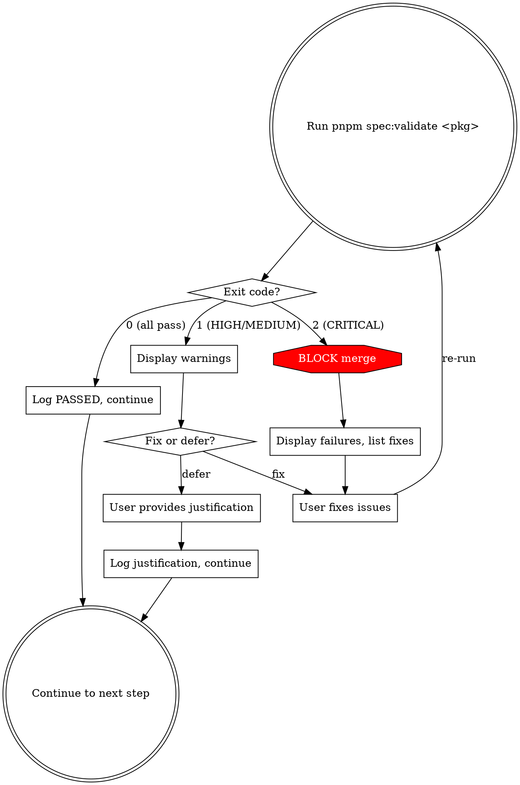

# Spec Reconciliation

## Overview

Pre-merge gate that runs `pnpm spec:validate` to catch spec-to-code drift before integration.

**Announce at start:** "Running spec-reconciliation to validate spec artifacts against implemented code."

## When to Use

- During `finishing-a-development-branch`, after verification-before-completion, before merge/PR
- After editing spec artifacts manually
- Retroactively on existing packages (`--all` flag)

**When NOT to use:**

- Hotfix track (Rule LXXXVII) -- time-critical, skip reconciliation
- Packages without spec directories (pre-methodology packages: logger, event-bus, auth-core)

## Integration Point

```
finishing-a-development-branch flow:
  1. All tests pass
  2. Build succeeds
  3. >>> spec-reconciliation check <<<
  4. Code review (requesting-code-review)
  5. PR/Merge
```

## Workflow



### Exit Code Reference

| Exit Code | Severity             | Action                          |
| --------- | -------------------- | ------------------------------- |
| 0         | All pass             | Continue to next step           |
| 1         | HIGH/MEDIUM warnings | Fix or defer with justification |
| 2         | CRITICAL failures    | Block merge until resolved      |

## Determining Package Name

1. If on a feature branch named like `feat/004-session-manager`, extract the spec directory name from the branch
2. If unclear, check which `specs/` directories were modified in the branch: `git diff main --name-only | grep '^specs/'`
3. If still unclear, ask the user which package to validate
4. For retroactive runs across all packages, use `--all` flag: `pnpm spec:validate --all`

## Common Mistakes

| Mistake                                       | Why it matters                                           |
| --------------------------------------------- | -------------------------------------------------------- |
| Running after merge instead of before         | Drift is already integrated; harder to fix               |
| Ignoring CRITICAL failures and merging anyway | Violates the merge gate -- specification drift compounds |
| Not re-running after fixing issues            | Fixes may introduce new inconsistencies                  |
