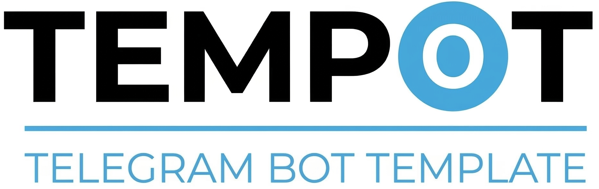

<div align="center">



<br><br>

### _Template × Bot_

**Enterprise framework for building production-ready Telegram bots with TypeScript.**

[](LICENSE)
[](https://www.typescriptlang.org/)
[](https://nodejs.org/)
[](https://grammy.dev/)
[](https://hono.dev/)
[](https://www.prisma.io/)
[](https://github.com/sponsors/SalehOsman)

[Features](#features) · [Quick Start](#quick-start) · [Packages](#packages) · [Architecture](#architecture) · [Tech Stack](#tech-stack) · [Docs](#documentation) · [Contributing](#contributing)

</div>

---

## What is Tempot?

Tempot gives you everything you need to build complex, production-ready Telegram bots — so you only write business logic. Authorization, sessions, caching, queues, AI integration, file storage, multi-language support, search, notifications, and document generation are all built-in, tested, and ready to use. It is a pnpm monorepo of independently versioned packages that can be adopted incrementally, from a single utility to the full stack.

> **Core Principle: "Don't reinvent the wheel."** — Every dependency is a proven, actively maintained library chosen over building from scratch. Every choice is documented in an Architectural Decision Record.

---

## Features

- **Type-Safe Everything** — TypeScript Strict Mode with zero `any` types. Every public API returns `Result<T, AppError>` via [neverthrow](https://github.com/supermacro/neverthrow) — no thrown exceptions, ever.
- **Role-Based Access Control** — 4-tier authorization (Guest → User → Admin → Super Admin) powered by [CASL](https://casl.js.org/), integrated directly into the data access layer.
- **AI-Ready** — Provider-agnostic AI integration via [Vercel AI SDK](https://sdk.vercel.ai/). Swap between Gemini, OpenAI, or any provider with zero code changes. Built-in fallbacks, circuit breakers, and graceful degradation.
- **Dual ORM Architecture** — [Prisma](https://www.prisma.io/) for relational data with full type safety, paired with [Drizzle](https://orm.drizzle.team/) for high-performance pgvector semantic search.
- **Multi-Tier Caching** — Memory → Redis → Database cascade via [cache-manager](https://github.com/jaredwray/cacheable). Configure once, use everywhere.
- **Event-Driven Architecture** — Modules communicate exclusively through a 3-tier event bus: in-process (local), cross-module (internal), and durable jobs ([BullMQ](https://bullmq.io/) + Redis).
- **Multi-Language & Regional** — Arabic-first with full English support via [i18next](https://www.i18next.com/). Built-in timezone, currency formatting, and RTL layout support.
- **Multi-Provider Storage** — Google Drive, AWS S3, and local filesystem through a unified storage interface. Switch providers without touching business logic.
- **Dynamic Input Engine** — [Zod](https://zod.dev/)-powered form generation with 22+ field types, automatic validation, retries, and timeout handling.
- **Battle-Tested Security** — Input sanitization ([sanitize-html](https://github.com/apostrophecms/sanitize-html)), rate limiting ([@grammyjs/ratelimiter](https://grammy.dev/plugins/ratelimiter)), schema validation, encrypted storage, and audit logging — all enabled by default.

---

## Quick Start

### Prerequisites

- Node.js v20+
- pnpm v10+ (`corepack enable pnpm`)
- Docker (for PostgreSQL + Redis)

### Setup

```bash
# Clone the repository
git clone https://github.com/SalehOsman/Tempot.git
cd tempot

# Install dependencies
pnpm install

# Configure environment
cp .env.example .env
# Edit .env → set BOT_TOKEN, DATABASE_URL, REDIS_URL

# Start infrastructure (PostgreSQL + Redis)
pnpm docker:dev

# Generate Prisma client and run migrations
pnpm --filter @tempot/database db:generate
pnpm --filter @tempot/database db:migrate --name init

# Start development
pnpm dev
```

---

## Packages

Tempot is a pnpm monorepo with modular, independently versioned packages.

### Core Infrastructure

| Package                   | Description                                               | Status |
| ------------------------- | --------------------------------------------------------- | ------ |
| `@tempot/shared`          | Error types, Result pattern, queue factory, cache wrapper | Stable |
| `@tempot/logger`          | Structured JSON logging + audit trail via Pino            | Stable |
| `@tempot/database`        | PostgreSQL schema, migrations, repository base classes    | Stable |
| `@tempot/event-bus`       | Local + durable event system with BullMQ                  | Stable |
| `@tempot/auth-core`       | RBAC + ABAC authorization via CASL                        | Stable |
| `@tempot/session-manager` | Dual Redis + PostgreSQL session management                | Stable |

### Services

| Package                   | Description                                       | Status   |
| ------------------------- | ------------------------------------------------- | -------- |
| `@tempot/i18n-core`       | Multi-language support via i18next                | Stable   |
| `@tempot/regional-engine` | Timezone, currency, geo data with dayjs           | Stable   |
| `@tempot/storage-engine`  | Google Drive + S3 + Local filesystem abstraction  | Stable   |
| `@tempot/ux-helpers`      | Message composer, keyboards, pagination, feedback | Building |
| `@tempot/ai-core`         | AI provider abstraction via Vercel AI SDK         | Planned  |
| `@tempot/cms-engine`      | Dynamic translation management                    | Planned  |
| `@tempot/notifier`        | Multi-channel notifications via BullMQ            | Planned  |
| `@tempot/document-engine` | PDF, Excel, Word generation                       | Planned  |
| `@tempot/input-engine`    | Dynamic form generation with Zod validation       | Planned  |
| `@tempot/search-engine`   | Full-text + semantic search with pgvector         | Planned  |
| `@tempot/import-engine`   | CSV, Excel import — event-driven processing       | Planned  |
| `@tempot/module-registry` | Module auto-discovery and validation              | Planned  |

### Applications

| App          | Description                    | Status  |
| ------------ | ------------------------------ | ------- |
| `bot-server` | grammY bot + Hono API server   | Planned |
| `dashboard`  | Next.js admin panel            | Planned |
| `mini-app`   | Telegram Mini App frontend     | Planned |
| `docs`       | Engineering documentation site | Planned |

---

## Architecture

Tempot follows a clean 3-tier architecture inside a pnpm monorepo:

```
┌─────────────────────────────────────────────────────────┐
│                   INTERFACE LAYER                        │
│      bot-server  ·  dashboard  ·  mini-app  ·  docs     │
├─────────────────────────────────────────────────────────┤
│                   SERVICE LAYER                          │
│   database · auth-core · logger · cache · queue ·       │
│   event-bus · ai-core · storage · i18n · ux-helpers     │
├─────────────────────────────────────────────────────────┤
│                    CORE LAYER                            │
│         Independent business modules                     │
│    Each with: handler · service · repository · tests    │
└─────────────────────────────────────────────────────────┘
```

Key principles:

- Modules communicate exclusively through the Event Bus — no direct cross-module imports
- External services (AI, storage, payments) are behind abstraction interfaces
- All caching goes through the unified cache-manager wrapper
- All queues use the centralized factory for graceful shutdown management

Full architecture documentation: [docs/tempot_v11_final.md](docs/tempot_v11_final.md) (29 sections, comprehensive specification)

---

## Tech Stack

Every technology choice is documented in an Architectural Decision Record with full rationale.

| Category       | Technology                            | Purpose                                             |
| -------------- | ------------------------------------- | --------------------------------------------------- |
| Runtime        | Node.js 20+                           | ESM, native TypeScript support                      |
| Language       | TypeScript 5.9 Strict                 | Full type safety, zero `any`                        |
| Bot Engine     | grammY 1.x                            | Modern, TypeScript-first Telegram framework         |
| Web Server     | Hono 4.x                              | Ultrafast, Edge-compatible, 15+ built-in middleware |
| Database       | PostgreSQL 16 + pgvector              | Relational data + vector search                     |
| Primary ORM    | Prisma 7.x                            | Type-safe queries, auto migrations                  |
| Vector ORM     | Drizzle 0.45.x                        | Native pgvector operations                          |
| Cache          | cache-manager 6.x                     | Multi-tier: Memory → Redis → DB                     |
| Queue          | BullMQ 5.x                            | Reliable job processing                             |
| AI             | Vercel AI SDK 4.x                     | Provider-agnostic AI abstraction                    |
| Auth           | CASL 6.x                              | RBAC + ABAC with Prisma adapter                     |
| Error Handling | neverthrow 8.x                        | Result pattern — no thrown exceptions               |
| Validation     | Zod                                   | Runtime schema validation                           |
| i18n           | i18next 25.x                          | Multi-language with JSON backends                   |
| Logging        | Pino 9.x                              | Fastest JSON logger for Node.js                     |
| Testing        | Vitest 4.x + Testcontainers           | Unit + containerized integration tests              |
| Security       | sanitize-html + @grammyjs/ratelimiter | XSS protection + rate limiting                      |
| Frontend       | Next.js + Tailwind CSS                | Dashboard + Mini App                                |
| Versioning     | Changesets                            | Automated semantic releases                         |

Tempot leverages 17 official and community grammY plugins across its packages — from auto-retry and rate limiting to interactive menus and streaming. See the full plugin map in [docs/developer/ecosystem-reference.md](docs/developer/ecosystem-reference.md).

---

## Documentation

| Document                                                     | Description                                                                |
| ------------------------------------------------------------ | -------------------------------------------------------------------------- |
| [Architecture Specification](docs/tempot_v11_final.md)       | Complete system design — 29 sections covering every aspect of Tempot       |
| [Ecosystem Reference](docs/developer/ecosystem-reference.md) | All external libraries and plugins mapped to their target packages         |
| [UX Style Guide](docs/guides/UX-STYLE-GUIDE.md)              | Standardized UX rules for bot, dashboard, and mini-app                     |
| [ADR Index](docs/architecture/adr/)                          | 31 Architectural Decision Records documenting every major technical choice |
| [Developer Workflow](docs/developer/workflow-guide.md)       | Step-by-step guide for contributors                                        |

---

## Contributing

Contributions are welcome. Before starting, please read the [Developer Workflow Guide](docs/developer/workflow-guide.md) to understand the project's development process.

Key guidelines:

- Follow the Result Pattern — no thrown exceptions
- Write tests first — TDD is mandatory (RED → GREEN → REFACTOR)
- All code, comments, and variables in English
- All user-facing text through i18n — zero hardcoded strings
- Follow [Conventional Commits](https://www.conventionalcommits.org/)

---

## Support the Project

If Tempot saves you development time, consider supporting its continued development:

- [Sponsor on GitHub](https://github.com/sponsors/SalehOsman)
- [Support on Ko-fi](https://ko-fi.com/tempot)
- [Buy Me a Coffee](https://www.buymeacoffee.com/tempot)

---

## Acknowledgments

### Built On

| Project                                 | Role in Tempot                                                                                                           |
| --------------------------------------- | ------------------------------------------------------------------------------------------------------------------------ |
| [grammY](https://grammy.dev/)           | The Telegram Bot Framework that powers Tempot's core. Its plugin ecosystem eliminated thousands of lines of custom code. |
| [Hono](https://hono.dev/)               | Ultrafast web framework with 15+ built-in middleware — the backbone of Tempot's API layer.                               |
| [Prisma](https://www.prisma.io/)        | Type-safe database access that makes data modeling a pleasure instead of a chore.                                        |
| [Vercel AI SDK](https://sdk.vercel.ai/) | Provider-agnostic AI abstraction that lets Tempot swap AI providers with zero code changes.                              |

### Development Partners

Tempot's architecture, specifications, and code quality are the result of a unique collaboration between human vision and AI-powered engineering tools:

| Partner                                                   | Contribution                                                                                                                                              |
| --------------------------------------------------------- | --------------------------------------------------------------------------------------------------------------------------------------------------------- |
| [SpecKit](https://github.com/github/spec-kit)             | GitHub's specification toolkit that drives Tempot's spec-driven development. Every feature starts as a rigorous specification before any code is written. |
| [Superpowers](https://github.com/obra/superpowers)        | The execution skill system that orchestrates TDD workflows, code reviews, and quality gates. The discipline behind Tempot's code quality.                 |
| [Claude](https://claude.ai/)                              | Anthropic's AI assistant — the tireless technical advisor and code author behind every package, test, and architectural decision.                         |
| [Gemini CLI](https://github.com/google-gemini/gemini-cli) | Google's AI-powered development environment. The primary executor that builds, tests, and reviews Tempot's code.                                          |
| [GitHub](https://github.com/)                             | The platform that hosts, versions, and enables the entire development workflow.                                                                           |

---

## License

This project is licensed under the [MIT License](LICENSE).

---

<div align="center">

**Tempot — All infrastructure included. Focus on what matters.**

`v0.1.0-alpha`

[Back to Top](#what-is-tempot)

</div>
