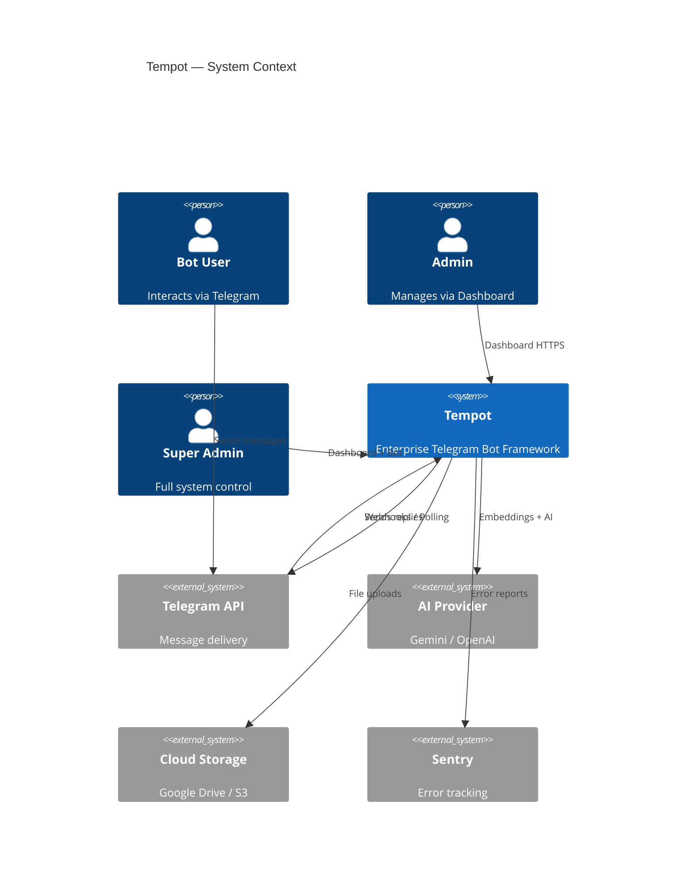
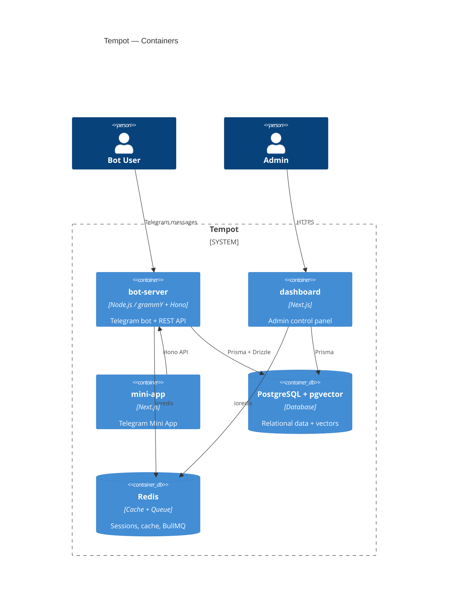
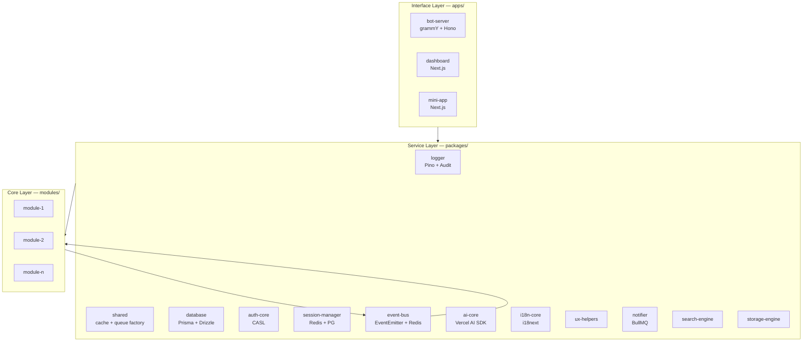
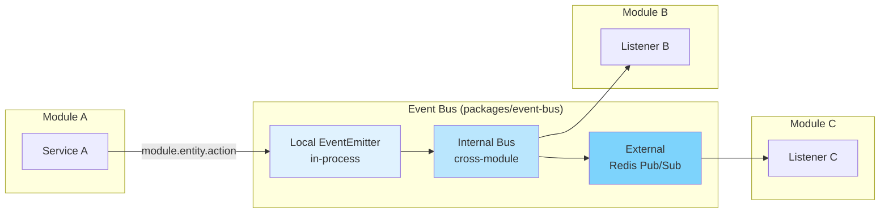
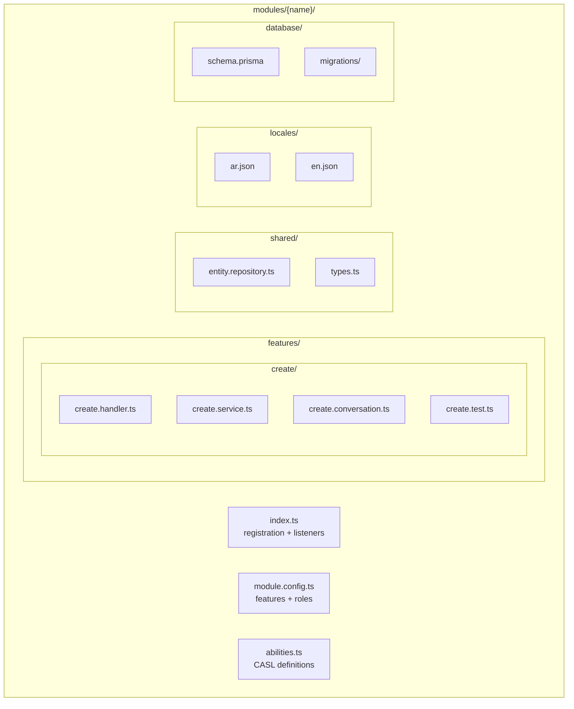
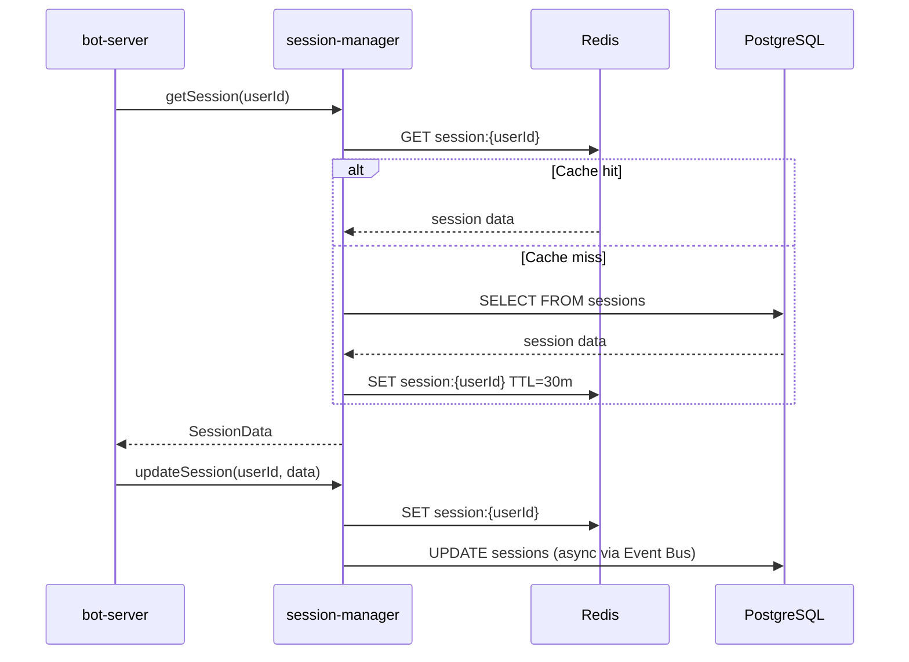
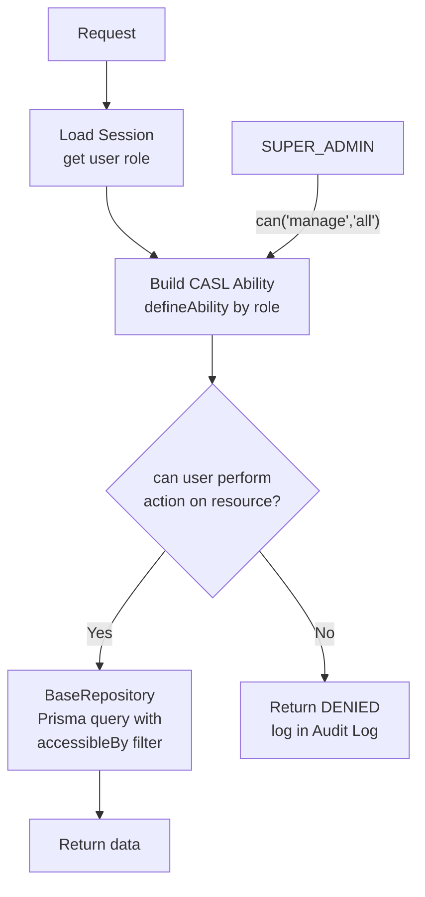
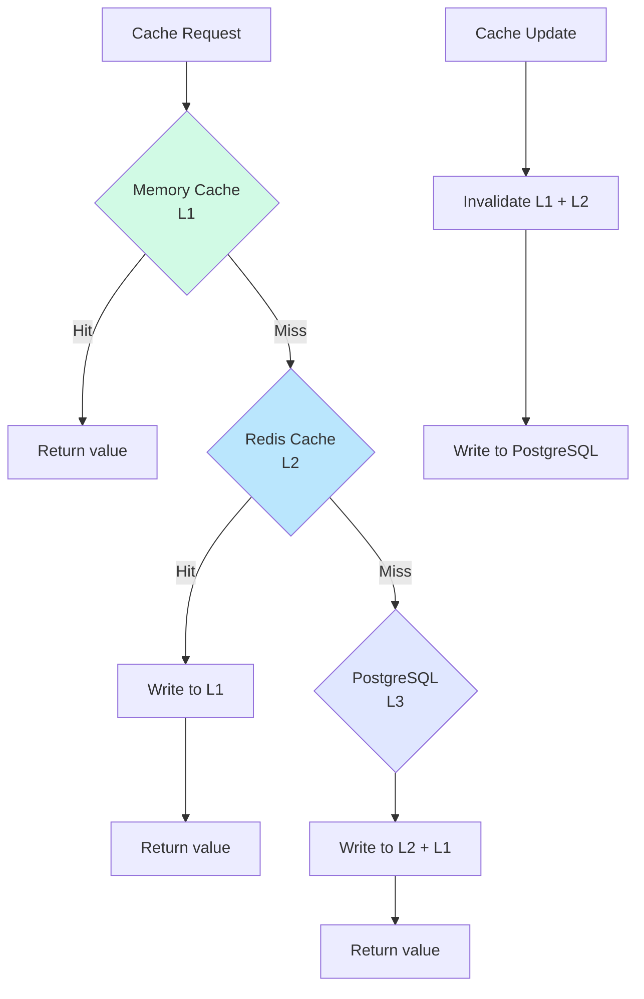
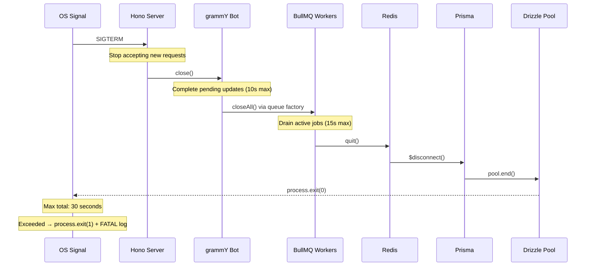
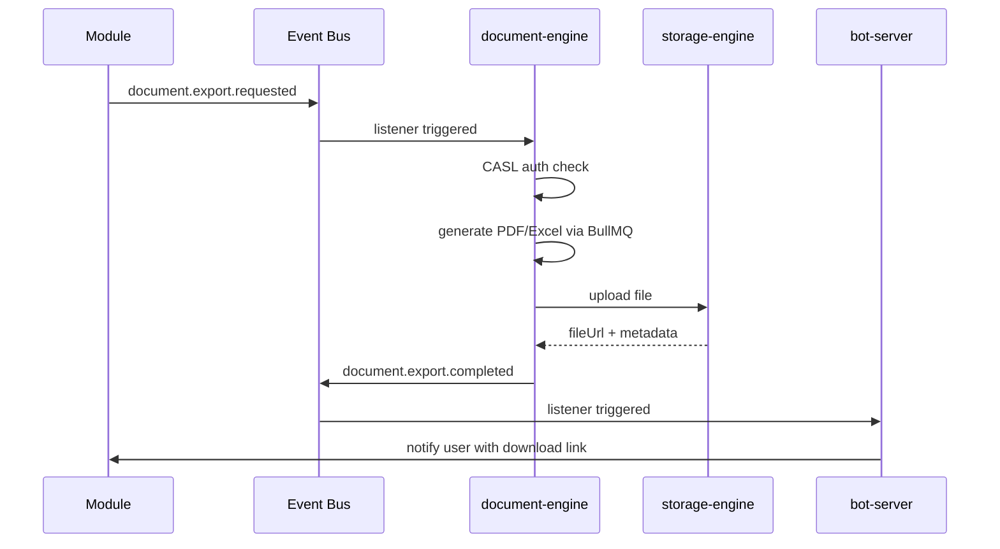

# Architecture Diagrams

> All diagrams use Mermaid syntax. Render in GitHub, VS Code (Mermaid extension), or [mermaid.live](https://mermaid.live).

---

## Diagram 1 — C4 Level 1: System Context



---

## Diagram 2 — C4 Level 2: Container Diagram



---

## Diagram 3 — Layer Architecture



---

## Diagram 4 — Security Chain

```mermaid
flowchart LR
  IN[Incoming Request] --> SH[sanitize-html\nXSS prevention]
  SH --> RL[@grammyjs/ratelimiter\nSpam protection]
  RL --> CASL[CASL Auth Check\nRole verification]
  CASL --> ZOD[Zod Validation\nSchema enforcement]
  ZOD --> BL[Business Logic]
  BL --> AL[Audit Log\nState change recorded]
  AL --> OUT[Response]

  style SH fill:#fef3c7
  style RL fill:#fef3c7
  style CASL fill:#fee2e2
  style ZOD fill:#fef3c7
  style AL fill:#d1fae5
```

---

## Diagram 5 — Event Bus Flow



---

## Diagram 6 — Module Anatomy



---

## Diagram 7 — Session Architecture



---

## Diagram 8 — CASL Authorization Flow



---

## Diagram 9 — Cache Hierarchy



---

## Diagram 10 — Graceful Shutdown Sequence



---

## Diagram 11 — Document Engine Event Flow


