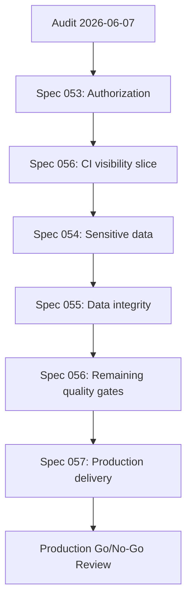

# Tempot SpecKit Remediation Program

**Program date:** 2026-06-07
**Source audit:** [Comprehensive Technical Audit](./README.md)
**Status:** SpecKit artifacts validated; awaiting Project Manager execution approval
**Planning branch:** `codex/project-audit-2026-06-07`

## Purpose

Convert the confirmed audit findings into independently reviewable SpecKit
delivery units with explicit dependencies, acceptance criteria, TDD tasks,
security and migration controls, and production go/no-go gates.

This program does not authorize implementation by itself. Each spec requires
its own execution branch/worktree, approved Superpowers design and granular
execution plan, RED -> GREEN -> REFACTOR evidence, code review, verification,
documentation synchronization, and merge decision.

## Program Specs

| Spec | Scope | Primary risk | Status | Implementation gate |
|---|---|---|---|---|
| [#053 Authorization Correction](../../../specs/053-authorization-correction/spec.md) | Correct global authorization and enforce action/subject policy | P0 functional/security | Artifact gates passed; Draft | First production-code remediation |
| [#054 Sensitive Data Protection](../../../specs/054-sensitive-data-protection/spec.md) | Encryption, lookup tokens, audit minimization, redaction, migration, rotation | P0 security/privacy | Artifact gates passed; Draft | Requires ADR, key runbook, backup and migration approval |
| [#055 Data Integrity Hardening](../../../specs/055-data-integrity-hardening/spec.md) | Atomic identity updates, soft delete, repository boundaries, aggregate counts | P1 data/architecture | Artifact gates passed; Draft | Requires database blast-radius review |
| [#056 Quality Gates Hardening](../../../specs/056-quality-gates-hardening/spec.md) | Complete app CI, coverage policy, docs freshness, toolchain and conformance | P1 assurance | Artifact gates passed; Draft | Early test-visibility slice precedes high-risk migrations |
| [#057 Production Delivery Hardening](../../../specs/057-production-delivery-hardening/spec.md) | Startup, HTTP, health, dependencies, image, supply chain, deployment, observability | P1 operations/security | Artifact gates passed; Draft | Final production-readiness program |

## SpecKit Validation Result

Cross-artifact analysis and repository reconciliation completed on 2026-06-07.

| Metric | Result |
|---|---:|
| Functional requirements | 109 |
| Success criteria | 44 |
| User stories | 19 |
| Actionable tasks | 214 |
| Requirement/task traceability gaps | 0 |
| Unresolved clarification/template markers | 0 |
| Critical cross-artifact issues | 0 |
| `pnpm spec:validate` | 330/330 passed |
| `pnpm lint` | Passed |
| Docs frontmatter validation | Passed |

The artifacts are internally consistent and ready for Project Manager review.
They are not implementation evidence. Existing runtime failures and the broken
documentation freshness command remain open work assigned to Specs #053-#057.

## Recommended Execution Order

The directory numbers group the approved specifications. Risk dependencies
determine execution order:

1. **Spec 053 - Authorization Correction**
   - Restore legitimate USER/ADMIN behavior.
   - Preserve denials and zero-mutation guarantees.
2. **Spec 056 - Quality Gate Foundation Slice**
   - Repair the two hidden bot-server test failures.
   - Add app projects to required root/CI execution.
   - Establish trustworthy RED/GREEN evidence before database/security work.
3. **Spec 054 - Sensitive Data Protection**
   - Stop new plaintext and observability leakage.
   - Rehearse and execute migration and key rotation only after approval.
4. **Spec 055 - Data Integrity Hardening**
   - Correct atomicity, soft deletion, repository boundaries, and pagination.
5. **Spec 056 - Remaining Quality Program**
   - Enforce coverage tiers, docs freshness, toolchain pinning, and source
     conformance.
6. **Spec 057 - Production Delivery Hardening**
   - Complete runtime, artifact, deployment, observability, and recovery gates.

Only one production-code remediation slice is active at a time. Specification
and review work may overlap when it does not change shared files.

## Dependency Graph

## Program Gates

### Gate A - Specification

For every spec:

- `spec.md`, `plan.md`, `research.md`, `data-model.md`, `tasks.md`, and
  checklist exist.
- No `[NEEDS CLARIFICATION]` marker remains.
- Requirements and success criteria map to executable tasks.
- `speckit-analyze` reports zero Critical issues.
- `pnpm spec:validate` reports zero Critical issues.

### Gate B - Execution Authorization

- Project Manager approves the current spec and scope.
- Superpowers brainstorming/design is approved.
- A dedicated worktree and branch exist.
- The granular execution plan is approved.
- No other conflicting shared-code remediation is active.

### Gate C - TDD and Review

- Every behavior change has observed RED evidence.
- GREEN is demonstrated with focused tests.
- Refactoring occurs only after GREEN.
- Review reports zero Critical findings.
- High findings are resolved or explicitly rejected with technical evidence.

### Gate D - Verification and Reconciliation

- Relevant focused and broad commands pass with fresh output.
- Acceptance criteria are demonstrated.
- Documentation and SpecKit artifacts match implementation.
- `speckit-analyze` and `pnpm spec:validate` pass.
- Required changesets and ADR index updates exist.

### Gate E - Production Go/No-Go

Production remains blocked until:

- Specs 053-057 approved implementation scope is complete.
- No Critical finding remains.
- No unapproved High security or production-readiness finding remains.
- Protected-data migration and key rotation are verified.
- Full workspace CI and component coverage policy pass.
- Signed immutable image passes staging, migration, smoke, observability,
  backup/restore, and rollback or forward-fix rehearsal.

## Management Milestones

| Milestone | Target outcome | Indicative duration |
|---|---|---:|
| M1: Correctness baseline | Authorization fixed and full app tests visible | 1-2 weeks |
| M2: Privacy baseline | New and historical protected data secured | 2-4 weeks |
| M3: Data/architecture baseline | Transactions, soft delete, repositories, counts corrected | 1-2 weeks |
| M4: Assurance baseline | Coverage, docs, toolchain, and conformance gates required | 1-2 weeks |
| M5: Production candidate | Signed minimal artifact and rehearsed deployment/recovery | 2-4 weeks |

Durations are planning estimates, not commitments. Migration volume, security
review, and infrastructure availability can change the critical path.

## Ownership Matrix

| Area | Accountable review role |
|---|---|
| Authorization and architecture | Senior Software Architect / Principal Backend Engineer |
| Encryption, redaction, dependency and supply chain | DevSecOps Engineer |
| Migration and database invariants | Principal Backend Engineer |
| Tests, coverage, acceptance and regression | QA/Test Lead |
| Scope, sequencing, approval and roadmap | Product/Technical Project Manager |
| Diff quality and constitution compliance | Code Reviewer |

## Immediate Next Action

Approve or revise the Spec #053 Draft. After approval, run Superpowers
brainstorming and create the granular execution plan for Spec #053 only.
