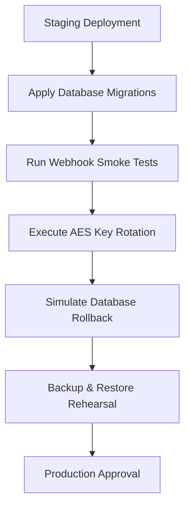

# 09 - Deployment & Operations Readiness

This document reviews deployment infrastructure, container security, operations procedures, and production release eligibility.

---

## 1. Deployment and CI/CD Infrastructure

Tempot features a production-grade deployment setup:

* **Multi-Stage Dockerfile (`apps/bot-server/Dockerfile`):** Excludes source code, tests, and configuration assets from the runner image. It runs Hono using a non-root user (`nodejs:hono`), minimizing security risks.
* **Supply Chain Hardening (`.github/workflows/docker.yml`):**
  * Generates BuildKit SBOM (Software Bill of Materials) and build provenance.
  * Scans images with Trivy, failing builds on High/Critical findings.
  * Signs images with Cosign and pushes verification signatures to GHCR.
* **Operational Segregation:** Liveness (`/live`) and readiness (`/ready`) endpoints check runtime dependencies (PostgreSQL and Redis) dynamically before routing requests.

---

## 2. Release Blocker Assessment

### Is the project deployable to production now?
**No.** While the codebase compiles and all pipelines pass, the project is **not ready** for production.

### What blocks the release?
The release is blocked by the **lack of operational evidence** under Spec #057 and Spec #054. Specifically:
1. **External Webhook Smoke Test:** Verification of Telegram webhook handling through a public URL (e.g., staging webhook smoke) is not completed.
2. **Key Rotation Rehearsal:** AES-256 key rotation migration in a staging database environment has not been executed and recorded.
3. **Rollback Rehearsal:** Verification of safe service downgrade and database rollback remains pending.
4. **Backup and Restore:** Evidence of database backups, restoration, and data verification in an isolated environment is incomplete.

---

## 3. Operational Prerequisites for Production Release

To clear Tempot for a production release, the operations team must execute and record the following steps:

### Operational Checklist:
- [ ] Deploy the latest signed Docker image digest (`ghcr.io/salehosman/tempot-bot-server@sha256:...`) to staging.
- [ ] Connect the staging container to a public webhook tunnel (e.g., Cloudflare Tunnel).
- [ ] Perform core Telegram bot interactions (start, profile, membership request) and record success logs.
- [ ] Verify that Sentry capturing is active and that alerts trigger on error.
- [ ] Rehearse a database backup, restore the snapshot, and verify data integrity.
