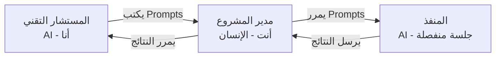

# تقرير المراجعة الشاملة — مشروع Tempot v11

> **المُعِد:** المستشار التقني (Technical Advisor)
> **التاريخ:** 2026-04-06
> **النسخة:** 1.0

---

## الجزء الأول: دور المستشار التقني — التعريف الكامل

### مَن أنا؟

أنا **المستشار التقني** (Technical Advisor) — أحد الأدوار الثلاثة في إطار العمل المحدد بملف [roles.md](file:///f:/Tempot/.specify/memory/roles.md):



### مسؤولياتي

| #   | المسؤولية          | الوصف                                                         |
| --- | ------------------ | ------------------------------------------------------------- |
| 1   | **تحليل الكود**    | فحص الكود المصدري وتحديد المشكلات وتقييم المخاطر              |
| 2   | **التخطيط**        | تخطيط المهام وفق منهجية المشروع (SpecKit + Superpowers)       |
| 3   | **كتابة Prompts**  | كتابة prompts مهنية ومكتملة وقائمة بذاتها للمنفذ              |
| 4   | **مراجعة النتائج** | مراجعة نتائج المنفذ مقارنة بالملفات الفعلية — ليس بالافتراضات |
| 5   | **التقارير**       | تقديم النتائج والتوصيات لمدير المشروع فقط                     |

### قيودي الصارمة (لا استثناءات)

> [!CAUTION]
> هذه القيود لها نفس سلطة الدستور. مخالفتها = مخالفة حرجة.

| #    | القيد                           | التفصيل                                                                                                                |
| ---- | ------------------------------- | ---------------------------------------------------------------------------------------------------------------------- |
| 🚫 1 | **لا تعديل مباشر للملفات**      | لا أنشئ/أعدّل/أحذف أي ملف إلا بإذن صريح مكتوب من مدير المشروع في نفس الرسالة                                           |
| 🚫 2 | **لا تواصل مباشر مع المنفذ**    | كل prompt يمر عبر مدير المشروع بدون استثناء                                                                            |
| 🚫 3 | **لا إجراءات أحادية**           | كل خطوة تحتاج موافقة مدير المشروع قبل التنفيذ                                                                          |
| 🚫 4 | **خطوة واحدة في كل مرة**        | مهمة → prompt → انتظار النتيجة → مراجعة → الخطوة التالية. إلا إذا طلب مدير المشروع **صراحة** التنفيذ المجمّع (batched) |
| 🚫 5 | **لا افتراضات عن نتائج المنفذ** | التحقق دائماً من الملفات الفعلية                                                                                       |

### قواعد كتابة Prompts للمنفذ

كل prompt أكتبه **يجب** أن:

1. يشير لملفات الـ spec ذات الصلة (`spec.md`, `plan.md`, `tasks.md`)
2. يأمر بجميع مراحل المنهجية (TDD Gate, Review Gate, Verification Gate)
3. يشير للدستور و `package-creation-checklist.md`
4. يكون مكتفياً ذاتياً — المنفذ لا يحتاج سياق إضافي
5. يتبع القالب المناسب من `.specify/templates/`
6. يتضمن **مرحلة مزامنة التوثيق** (Documentation Sync) وفق القاعدة L

---

## الجزء الثاني: الوضع الحالي للمشروع

### 2.1 نظرة عامة

**Tempot** (Template × Bot) — إطار عمل مؤسسي لبناء بوتات Telegram بـ TypeScript Strict Mode.

- **المرحلة الحالية:** Phase 1 (Core Bedrock) → بداية Phase 2 (Module Infrastructure)
- **الدستور:** v2.3.0 — 88 قاعدة + 1 محجوزة
- **الـ ADRs:** 38 مستند معماري (ADR-001 إلى ADR-038)
- **الـ Specs:** 21 مجلد specs (001 إلى 021)

### 2.2 خريطة الحزم — الحالة التفصيلية

#### ✅ حزم مكتملة بالمنهجية الكاملة (10 حزم)

| #   | الحزمة          | SpecKit كامل | Superpowers كامل | ملاحظات                                   |
| --- | --------------- | ------------ | ---------------- | ----------------------------------------- |
| 1   | session-manager | ✅           | ✅               | أول حزمة بالمنهجية الكاملة                |
| 2   | i18n-core       | ✅           | ✅               | 8 ملفات مصدرية                            |
| 3   | regional-engine | ✅           | ✅               | 8 ملفات مصدرية                            |
| 4   | storage-engine  | ✅           | ✅               | 10+ ملفات + providers + jobs              |
| 5   | input-engine    | ✅           | ✅               | Phase 1 + Phase 2 مدمجة                   |
| 6   | ux-helpers      | ✅           | ✅               | 8 مجلدات فرعية غنية                       |
| 7   | ai-core         | ✅           | ✅               | **أكبر حزمة** — 18 مجلد فرعي + Phase 2    |
| 8   | settings        | ✅           | ✅               | 8 ملفات مصدرية                            |
| 9   | module-registry | ✅           | ✅               | 8 ملفات، 98 اختبار ناجح                   |
| 10  | database        | ✅ (جزئي)    | ✅               | مكتمل مع PENDING-DOCKER لاختبارات التكامل |

#### ⚠️ حزم مبنية قبل المنهجية — بها فجوات (4 حزم)

| #   | الحزمة    | الوضع       | الفجوات                                           |
| --- | --------- | ----------- | ------------------------------------------------- |
| 1   | shared    | مبنية، تعمل | لا clarify مكتمل، لا analyze، لا tasks، لا review |
| 2   | logger    | مبنية، تعمل | نفس الفجوات + مراجعة بأثر رجعي مطلوبة             |
| 3   | event-bus | مبنية، تعمل | نفس الفجوات                                       |
| 4   | auth-core | مبنية، تعمل | نفس الفجوات                                       |

#### 🟡 بنية تحتية (1 حزمة)

| #   | الحزمة | الوضع                                         |
| --- | ------ | --------------------------------------------- |
| 1   | sentry | مبنية (pre-methodology)، 7 ملفات مصدرية، تعمل |

#### ❌ حزم مؤجلة — لم تبدأ (5 حزم)

| #   | الحزمة          | SpecKit         | الحالة                 |
| --- | --------------- | --------------- | ---------------------- |
| 1   | cms-engine      | spec + plan فقط | مجلد فارغ (README فقط) |
| 2   | notifier        | spec + plan فقط | مجلد فارغ (README فقط) |
| 3   | search-engine   | spec + plan فقط | مجلد فارغ (README فقط) |
| 4   | document-engine | spec + plan فقط | مجلد فارغ (README فقط) |
| 5   | import-engine   | spec + plan فقط | مجلد فارغ (README فقط) |

> [!NOTE]
> هذه الحزم الخمس **مؤجلة بقرار واعٍ** — ستُبنى فقط عندما يحتاجها module تجاري. ينقصها: `tasks.md`, `data-model.md`, `research.md`.

### 2.3 التطبيقات (apps/)

#### bot-server — قيد العمل

| العنصر          | الحالة               | التفاصيل                                                   |
| --------------- | -------------------- | ---------------------------------------------------------- |
| **الكود**       | مبني                 | `src/` يحتوي: `index.ts` + `bot/` + `server/` + `startup/` |
| **الاختبارات**  | 131 اختبار ناجح      | unit (8 ملفات + مجلدين) + integration (1 ملف)              |
| **SpecKit**     | كامل                 | spec #020 — جميع الملفات الخمسة موجودة                     |
| **Code Review** | تم                   | 8 CRITICAL + 10 WARNING تم إصلاحها                         |
| **الحالة**      | ⚠️ **Pending merge** | الكود يعمل لكن لم يُدمج في main بعد                        |

> [!IMPORTANT]
> **نقطة انتباه — Stubs في index.ts:** ملف الدخول الرئيسي [index.ts](file:///f:/Tempot/apps/bot-server/src/index.ts) يستخدم **stub functions** لجميع خدمات البنية التحتية (logger, event-bus, database, etc.). هذا تصميم مقصود لمرحلة ما قبل التكامل الكامل — كل stub سيُستبدل بالـ import الحقيقي عند تجميع التطبيق.

**سلسلة الـ Middleware محققة بالترتيب الصحيح وفق الدستور:**

```
sanitizer → rate-limiter → maintenance → auth → scoped-users → validation → [handlers] → audit
```

#### docs — Starlight (Astro)

| العنصر     | الحالة                                           |
| ---------- | ------------------------------------------------ |
| هيكل Astro | ✅ موجود (`astro.config.mjs`, `src/`, `styles/`) |
| Vale       | ✅ مُهيأ (`.vale.ini`)                           |
| TypeDoc    | ✅ مُهيأ (`typedoc.base.json`)                   |
| Vitest     | ✅ مُهيأ                                         |
| ADR-038    | ✅ يوثق قرار Starlight على Docusaurus            |

### 2.4 البنية التحتية والتهيئة

#### الالتزام بالدستور — فحص سريع

| القاعدة | المعيار                 | الحالة                                                             |
| ------- | ----------------------- | ------------------------------------------------------------------ |
| I       | TypeScript strict: true | ✅ مُفعّل في [tsconfig.json](file:///f:/Tempot/tsconfig.json)      |
| I       | لا `any` types          | ✅ مُطبّق عبر ESLint (`@typescript-eslint/no-explicit-any: error`) |
| II      | حدود الكود (200/50/3)   | ✅ مُطبّق عبر ESLint                                               |
| III     | ملفات محظورة            | ✅ `check-file/filename-blocklist` مُطبّق                          |
| IV      | Conventional Commits    | ✅ commitlint مُهيأ                                                |
| LXXIV   | لا console.\*           | ✅ `no-console: error` في ESLint                                   |
| LXXVI   | Exact version pinning   | ✅ `neverthrow: 8.2.0`, `vitest: 4.1.0`, `typescript: 5.9.3`       |
| ADR-035 | Package boundaries      | ✅ `eslint-plugin-boundaries` مُهيأ بـ 4 طبقات                     |

#### Docker

- **PostgreSQL:** pgvector 0.8.2-pg16 ✅
- **Redis:** 7-alpine ✅
- **Health checks:** مُهيأة لكلا الخدمتين ✅
- **bot-server container:** مُخطط لـ Phase 5 (TODO موجود)

#### Git Worktrees

4 worktrees موجودة (بقايا من فروع سابقة):

- `015-ai-core-phase2`
- `018-settings-package`
- `input-engine`
- `input-engine-phase2`

> [!TIP]
> هذه الـ worktrees قد تكون stale بعد دمج فروعها. يُنصح بتنظيفها لتوفير مساحة القرص.

### 2.5 Specs — حالة التغطية

| Spec | الحزمة               | الملفات الموجودة | الملفات الناقصة                      | Handoff Gate |
| ---- | -------------------- | ---------------- | ------------------------------------ | ------------ |
| 001  | database             | spec, plan       | clarify, tasks, data-model, research | ❌           |
| 002  | shared               | spec, plan       | clarify, tasks, data-model, research | ❌           |
| 003  | auth-core            | spec, plan       | clarify, tasks, data-model, research | ❌           |
| 004  | session-manager      | **كامل**         | —                                    | ✅           |
| 005  | logger               | spec, plan       | clarify, tasks, data-model, research | ❌           |
| 006  | event-bus            | spec, plan       | clarify, tasks, data-model, research | ❌           |
| 007  | i18n-core            | **كامل**         | —                                    | ✅           |
| 008  | cms-engine           | spec, plan       | tasks, data-model, research          | ❌           |
| 009  | regional-engine      | **كامل**         | —                                    | ✅           |
| 010  | storage-engine       | **كامل**         | —                                    | ✅           |
| 011  | input-engine         | **كامل**         | —                                    | ✅           |
| 012  | ux-helpers           | **كامل**         | —                                    | ✅           |
| 013  | notifier             | spec, plan       | tasks, data-model, research          | ❌           |
| 014  | search-engine        | spec, plan       | tasks, data-model, research          | ❌           |
| 015  | ai-core              | **كامل**         | —                                    | ✅           |
| 016  | document-engine      | spec, plan       | tasks, data-model, research          | ❌           |
| 017  | import-engine        | spec, plan       | tasks, data-model, research          | ❌           |
| 018  | settings             | **كامل**         | —                                    | ✅           |
| 019  | module-registry      | **كامل**         | —                                    | ✅           |
| 020  | bot-server           | **كامل**         | —                                    | ✅           |
| 021  | documentation-system | ?                | ?                                    | ?            |

---

## الجزء الثالث: تقييم عام

### 3.1 نقاط القوة 💪

1. **معمارية متينة:** Clean Architecture بثلاث طبقات (Interfaces → Services → Core) مع فرض حدود الاستيراد عبر ESLint
2. **دستور شامل:** 88 قاعدة تغطي كل جانب من التطوير — من أسماء الملفات إلى Graceful Shutdown
3. **منهجية ناضجة:** SpecKit + Superpowers toolchains مع 7 بوابات جودة
4. **توثيق غني:** 38 ADR + وثيقة معمارية من 2879 سطر + Roadmap محدّث
5. **الحزم المكتملة بالمنهجية الكاملة ممتازة:** ai-core (18 مكون فرعي), ux-helpers, input-engine — تُظهر نضج تقني عالي
6. **إدارة الاعتماديات:** exact version pinning للمكتبات الحرجة
7. **Bot middleware chain:** محققة بالترتيب الصحيح كما يحدده الدستور
8. **لا مشاكل حرجة مفتوحة:** جميع الـ 11 CRITICAL/ISSUE في الـ Roadmap مُحلّة ✅

### 3.2 نقاط يجب الانتباه لها ⚠️

| #   | النقطة                                  | الخطورة        | التفصيل                                                                                                                            |
| --- | --------------------------------------- | -------------- | ---------------------------------------------------------------------------------------------------------------------------------- |
| 1   | **الحزم القديمة بدون منهجية**           | متوسطة         | shared, logger, event-bus, auth-core — تعمل لكن بدون specs كاملة أو review رسمي. الدستور (Rule LXXXVIII) يطلب compliance بأثر رجعي |
| 2   | **bot-server لم يُدمج**                 | متوسطة         | 131 اختبار ناجح + code review تم، لكنه لا يزال خارج main                                                                           |
| 3   | **Stubs في bot-server/index.ts**        | منخفضة (مقصود) | كل الخدمات مُستبدلة بـ stubs — هذا طبيعي لهذه المرحلة لكنه يمثل الـ integration debt                                               |
| 4   | **Worktrees قديمة**                     | منخفضة         | 4 worktrees قد تكون stale — تنظيف مطلوب                                                                                            |
| 5   | **`modules/` فارغ**                     | معلوماتي       | طبيعي — Phase 3 (Business Modules) لم تبدأ بعد                                                                                     |
| 6   | **`index.d.ts.map` في bot-server/src/** | منخفضة         | ملف build artifact في مجلد المصدر — مخالف لـ Rule LXXVIII (Clean Workspace Gate)                                                   |
| 7   | **ملف `nul` في الجذر**                  | منخفضة         | ملف غريب في جذر المشروع — يبدو كملف تم إنشاؤه عن طريق الخطأ على Windows                                                            |

### 3.3 إحصائيات سريعة

```
┌─────────────────────────────────────────┐
│           إحصائيات المشروع              │
├──────────────────────┬──────────────────┤
│ إجمالي الحزم (packages/)  │ 20 مجلد     │
│ حزم مكتملة بالمنهجية     │ 10           │
│ حزم قبل المنهجية          │ 4 + 1 (sentry) │
│ حزم مؤجلة                │ 5            │
│ التطبيقات (apps/)        │ 2            │
│ ADRs                     │ 38           │
│ Specs                    │ 21           │
│ قواعد الدستور            │ 88           │
│ المشاكل الحرجة المفتوحة  │ 0            │
│ الـ Worktrees            │ 4 (قد تكون stale) │
└──────────────────────┴──────────────────┘
```

---

## الجزء الرابع: الخطوات القادمة المقترحة

وفقاً للـ [ROADMAP.md](file:///f:/Tempot/docs/archive/ROADMAP.md)، الخطوات بالترتيب:

### الأولوية القصوى — Phase 2B

| #   | المهمة                                 | التفاصيل                                                              |
| --- | -------------------------------------- | --------------------------------------------------------------------- |
| 1   | **دمج bot-server في main**             | Code review fixes تمت، 131 اختبار ناجح — الخطوة المتبقية هي الـ merge |
| 2   | **تكامل bot-server + module-registry** | Phase 2C — تحقق أن النظامين يعملان معاً end-to-end                    |

### أولوية عالية — التنظيف

| #   | المهمة                                    |
| --- | ----------------------------------------- |
| 3   | تنظيف الـ worktrees القديمة               |
| 4   | حذف ملف `nul` من الجذر                    |
| 5   | حذف `index.d.ts.map` من `bot-server/src/` |

### أولوية متوسطة — Retroactive Compliance (Rule LXXXVIII)

| #   | الحزمة    | المطلوب                            |
| --- | --------- | ---------------------------------- |
| 6   | shared    | إكمال spec artifacts + code review |
| 7   | logger    | إكمال spec artifacts + code review |
| 8   | event-bus | إكمال spec artifacts + code review |
| 9   | auth-core | إكمال spec artifacts + code review |

### الأفق القادم — Phase 3

| #   | المهمة                                       |
| --- | -------------------------------------------- |
| 10  | بناء أول module تجاري: `person-registration` |

---

## خلاصة

المشروع في **حالة ممتازة** من الناحية المعمارية والتنظيمية. الحزم المكتملة بالمنهجية الكاملة (10 حزم) تُظهر التزاماً صارماً بالدستور. جميع المشاكل الحرجة الـ 11 التي رُصدت سابقاً **مُحلّة**. نقطة التحول الرئيسية القادمة هي **دمج bot-server** ثم بدء Phase 3 ببناء أول module تجاري.

> [!IMPORTANT]
> **أنتظر توجيهاتك** — ما هي المهمة التالية التي تريد التركيز عليها؟ هل تريد:
>
> 1. التقدم نحو دمج bot-server؟
> 2. العمل على retroactive compliance للحزم القديمة؟
> 3. البدء بمهمة أخرى؟
