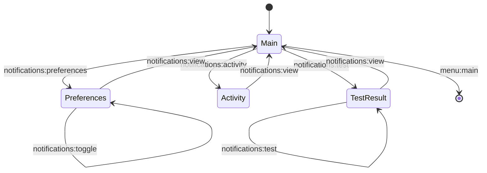

# Data Model: notification-center

The first functional notification-center iteration does not introduce new
database tables. It composes existing runtime and observable data.

## Runtime Entities

### NotificationCenterSurface

- `surfaceId`: stable identifier for the current screen.
- `surfaceType`: one of `parent`, `leaf`, or `result`.
- `openedBy`: callback or command that opens the surface.
- `visibleActions`: callback actions rendered on the surface.

### NotificationTestRequest

- `telegramId`: Telegram user id from `ctx.from.id`.
- `chatId`: Telegram chat id when available.
- `requestedAt`: ISO timestamp generated when the user presses the test action.
- `reference`: short diagnostic reference displayed in the result surface.

### NotificationPreferenceSnapshot

- `telegramId`: Telegram user id when available.
- `deliveryEnabled`: current effective delivery state.
- `source`: `@tempot/settings` dynamic setting `notifications_enabled`.
- `mutationsAvailable`: `true` for the global delivery enablement toggle.

### NotificationPreferenceUpdate

- `telegramId`: Telegram user id from `ctx.from.id`.
- `oldValue`: previous `notifications_enabled` value.
- `newValue`: persisted `notifications_enabled` value.
- `updatedBy`: Telegram user id used as the settings updater reference.

### NotificationActivityItem

- `source`: `interactionEvents` or `auditLog`.
- `action`: notification-related action or callback.
- `status`: recorded status.
- `occurredAt`: event timestamp.
- `referenceCode`: optional error or diagnostic reference.

## State Transitions

## Persistence Decision

No new database table is added in this spec update. The module persists global
notification enablement through the existing `settings` table using the
`notifications_enabled` dynamic setting. Persistent per-user notification
categories, quiet hours, and priority rules require a future dedicated
user-preference data-model change.
