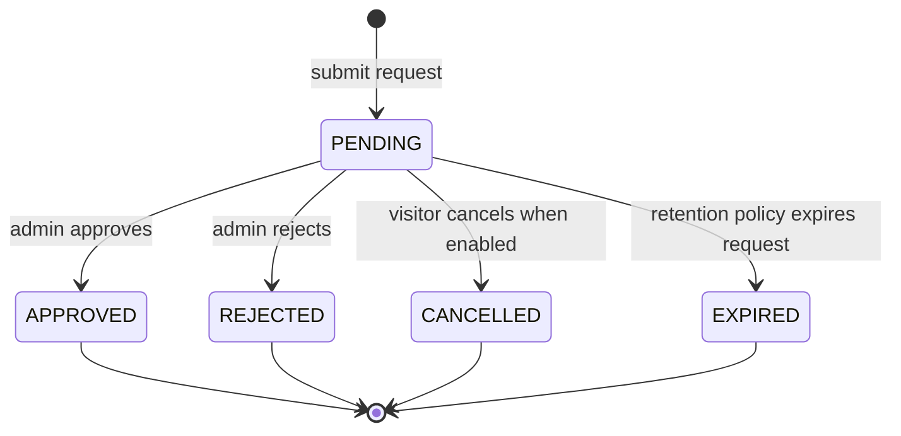

# Data Model: Bot Access Mode and Membership Gate

## BotAccessSettings

Stores the effective bot exposure policy.

| Field | Type | Required | Notes |
| --- | --- | --- | --- |
| `accessMode` | `private | public` | Yes | Defaults to `private` when unset |
| `defaultMemberRole` | `USER` or configured role id | Yes | Initial role assigned after approval |
| `joinRequestEnabled` | boolean | Yes | Default `true` in private mode |
| `publicVisitorCapabilities` | string[] | No | Optional explicit allow-list for public mode |
| `updatedByUserId` | string | No | Required for admin changes |
| `updatedAt` | DateTime | Yes | Last update time |

### Validation Rules

- Missing `accessMode` resolves to `private`.
- Invalid `accessMode` must not become public.
- `defaultMemberRole` must be a role that can be assigned to a new member.
- Changes must be audited.

## MembershipRequest

Tracks a visitor request to become a member.

| Field | Type | Required | Notes |
| --- | --- | --- | --- |
| `id` | UUID | Yes | Primary identifier |
| `telegramId` | BigInt/string | Yes | Identity key; stored consistently with user-management lookup |
| `telegramUsername` | string | No | Snapshot at request time |
| `telegramFirstName` | string | No | Snapshot at request time |
| `telegramLastName` | string | No | Snapshot at request time |
| `telegramLanguageCode` | string | No | Snapshot at request time |
| `status` | `PENDING | APPROVED | REJECTED | CANCELLED | EXPIRED` | Yes | Current lifecycle status |
| `requestMessage` | protected string | No | Optional visitor note, protected if persisted |
| `reviewerUserId` | string | No | Admin reviewer |
| `reviewerNote` | protected string | No | Optional admin note |
| `rejectionReason` | protected string | No | Visitor-facing reason through i18n-safe rendering |
| `createdUserProfileId` | string | No | Set when approval creates or activates a profile |
| `requestedAt` | DateTime | Yes | Submission time |
| `reviewedAt` | DateTime | No | Approval or rejection time |
| `createdAt` | DateTime | Yes | Persistence timestamp |
| `updatedAt` | DateTime | Yes | Persistence timestamp |

### Constraints

- At most one active `PENDING` request per `telegramId`.
- Approval and rejection are terminal for that request.
- Concurrent review must result in exactly one terminal decision.
- Request status reads must not expose protected fields to unauthorized visitors.

### State Transitions

## AccessActor

Runtime identity object produced for each Telegram interaction.

| Field | Type | Required | Notes |
| --- | --- | --- | --- |
| `telegramId` | BigInt/string | Yes | From Telegram update |
| `profileId` | string | No | Present for active members |
| `role` | role id | No | Present for active members |
| `state` | `UNKNOWN | PENDING | REJECTED | MEMBER | ADMIN | SUPER_ADMIN` | Yes | Derived state |
| `abilities` | ability list | Yes | Empty for unknown/pending unless public capability applies |
| `membershipRequestId` | UUID | No | Present for pending/rejected visitors when available |
| `resolutionStatus` | `resolved | failed` | Yes | Failed resolution denies protected behavior |

## AccessDecision

Runtime result of evaluating an actor against an action.

| Field | Type | Required | Notes |
| --- | --- | --- | --- |
| `allowed` | boolean | Yes | Final decision |
| `reason` | enum/string | Yes | Audit-safe reason code |
| `actorState` | AccessActor state | Yes | State used for decision |
| `accessMode` | Bot access mode | Yes | Effective mode |
| `capabilityId` | string | Yes | Command, callback, or menu capability |
| `classification` | capability classification | Yes | Bootstrap/public/member/protected/admin |
| `auditRequired` | boolean | Yes | True for denials and state-changing actions |

## MenuCapability

Declarative item used by menu rendering and execution revalidation.

| Field | Type | Required | Notes |
| --- | --- | --- | --- |
| `id` | string | Yes | Stable capability id |
| `moduleId` | string | Yes | Owning module |
| `labelKey` | i18n key | Yes | No hardcoded text |
| `command` | string | No | Telegram command |
| `callbackPrefix` | string | No | Callback namespace |
| `classification` | `bootstrap | public | member | protected | admin` | Yes | Unclassified is invalid and treated as protected during migration |
| `requiredAbility` | CASL ability tuple | No | Required for protected/admin/member capabilities |
| `enabled` | boolean | Yes | Module and settings aware |

## Domain Events

| Event | Producer | Consumer | Purpose |
| --- | --- | --- | --- |
| `membership-management.request.submitted` | membership-management | audit/notifications | Request created |
| `membership-management.request.approved` | membership-management | user-management/audit | Profile creation or activation requested |
| `membership-management.request.rejected` | membership-management | audit/notifications | Request rejected |
| `membership-management.request.cancelled` | membership-management | audit | Request cancelled |
| `user-management.profile.created_from_membership` | user-management | membership-management/audit | Approval outcome |
| `bot-access-mode.changed` | settings-management or bot-management | audit/runtime cache | Access mode updated |
